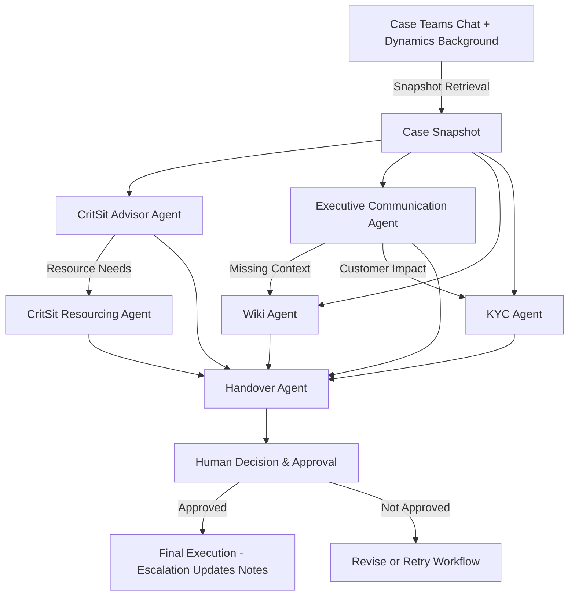
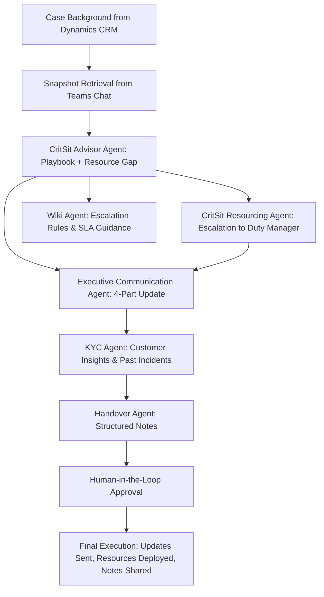

# 🚀 Multi-Agent Critical Situation Support System

## 📖 Overview

This project introduces a **multi-agent collaboration framework** for managing **critical situation (CritSit) cases** in enterprise environments. Instead of relying on a single monolithic agent, this system leverages **specialized agents** that each focus on a distinct aspect of case handling — while working together in a **shared context**.

The design is fully **human-in-the-loop**: agents can propose, analyze, and trigger each other, but **final execution always requires human decision-making**.

---

## 🧑‍🤝‍🧑 Key Agents

1. **CritSit Advisor Agent**

   * Analyzes ongoing case progress.
   * Provides structured playbooks with timeline, blockers, and next steps.
   * Can trigger resourcing or escalation workflows (pending human confirmation).

2. **Executive Communication Agent**

   * Produces **four-part structured case updates**.
   * Adapts style depending on executive audience (e.g., VIP vs broad leadership).

3. **Wiki Agent**

   * Supplies **process, policy, and governance knowledge**.
   * Ensures compliance with internal protocols.

4. **Know Your Customer (KYC) Agent**

   * Delivers customer-specific insights (tenant usage, historical cases, adoption patterns).
   * Helps contextualize case impact and priority.

5. **CritSit Resourcing Agent** *(planned)*

   * Assists with **resource requests and duty manager escalations**.
   * Can auto-generate escalation emails or trigger escalation workflows.
   * **Execution requires human approval**.

6. **Handover Agent**

   * Generates structured **handover notes** for shift changes.
   * Highlights risks, pending tasks, and ownership clarity.

7. **Snapshot Retrieval (Graph & Dynamics)**

   * Pulls the **latest Teams conversation updates** from case channels.
   * Retrieves **Dynamics case background** or CMET Agent extracts.
   * Provides **context snapshots** that agents reference when producing outputs.

---

## 🔄 Automated Inter-Agent Collaboration

Agents can **request services from one another** to complete complex workflows:

* **CritSit Advisor** → may trigger **Resourcing Agent** if additional resources are needed.
* **Executive Communication Agent** → may call **Wiki Agent** or **KYC Agent** to enrich updates.
* **Handover Agent** → aggregates outputs from all others to prepare structured notes.

⚠️ **Human-in-the-Loop Control**

* While agents can invoke each other, **all actions that impact escalation, communication, or execution require explicit human approval**.
* This ensures **safety, accountability, and governance compliance**.

---

## 🧩 Why Multi-Agent Instead of One Big Agent?

* **Specialization** → Each agent focuses deeply on a single domain, ensuring precision and consistency.
* **Independent Workflows** → Agents run in parallel, avoiding bottlenecks or entangled logic.
* **Scalability** → New agents can be added without disrupting existing ones.
* **Robustness** → Failure of one agent doesn’t collapse the whole system.
* **Human Control** → Multi-agent orchestration allows **fine-grained human decision points** rather than delegating everything to one “black box” super-agent.

💡 **Analogy:**
This is like a hospital team: surgeons, nurses, and pharmacists each specialize in their domain. They coordinate, but **a human chief doctor makes the final call**.

---

## 🌟 Value Proposition

* **Faster insights** → Real-time snapshots from Teams & Dynamics.
* **Higher clarity** → Each agent delivers outputs in structured formats.
* **Reduced risk** → Human-in-the-loop approval ensures safe decisions.
* **Future-ready** → Easily extensible with new agents (e.g., Risk Prediction, Automated Reporting).

---

## 🛠️ System Flow (Mermaid Diagram)

---

## ✅ Human-in-the-Loop Guarantee

* **Agents provide analysis, drafts, and recommendations.**
* **Humans review, approve, or reject before execution.**
* **No fully autonomous escalation or customer communication is performed.**

---

## 🔥 Real-World Example: Urgent Security Incident Case

**Case Background**
A **Sev A urgent security incident** is reported in Dynamics CRM.

* **Customer**: A global financial services company.
* **Impact**: Security vulnerability in a critical workload causing service disruptions.
* **Customer Pressure**: Executives escalating urgency, demanding immediate mitigation and regular updates.

---

### ⚡ End-to-End Multi-Agent Collaboration

1. **Background Retrieval**

   * Copilot fetches **case background** directly from **Dynamics CRM**.
   * Includes: case description, customer details, historical actions, initial severity.

2. **Snapshot Retrieval (Teams Chat)**

   * System collects the **latest timeline, actions, blockers, and owners** from the Teams incident war room chat.
   * This becomes the **“live case snapshot”** forming shared context for all agents.

3. **CritSit Advisor Agent**

   * Reviews case background + snapshot.
   * Generates an **actionable playbook**:

     * Immediate containment steps.
     * Long-term mitigation plan.
     * Risk assessment & customer comms guidance.
   * Detects a **resource gap**: additional engineers needed.

4. **CritSit Resourcing Agent**

   * Escalates to **Duty Manager** for additional resource allocation.
   * Prepares escalation emails, tracks engineer assignment, ensures staffing coverage.

5. **Wiki Agent**

   * Confirms escalation rules & SLA policies.
   * Provides compliance references for urgent security incident handling.

6. **Executive Communication Agent**

   * Drafts a **4-part structured update** for executives:

     1. Current Status
     2. Customer Impact
     3. Action Plan
     4. Next Steps
   * Tailors tone/style for **different VIP stakeholders** (CIO, VP Security, etc.).

7. **KYC Agent**

   * Supplements updates with **customer-specific insights**:

     * Business criticality of affected systems.
     * Past security incidents.
     * Known executive sensitivities.

8. **Handover Agent**

   * Creates **structured handover notes**:

     * Case summary.
     * Actions completed.
     * Pending work.
     * Owners & next checkpoints.

9. **Human-in-the-Loop Control**

   * At every critical stage (advisor recommendations, resource escalation, executive updates), the **incident manager reviews and approves** before execution.
   * Ensures **human oversight and accountability**.

---

### 🌟 Why This Matters

* **Shared Context**: Agents consume the same Dynamics + Teams data.
* **Specialization**: Each agent focuses on one expertise (advisory, resourcing, comms, policy, customer insights, handover).
* **Safety & Control**: No fully autonomous execution—**final decisions are made by humans**.
* **Impact**: Faster coordination, higher-quality comms, reduced risk, and better customer confidence.

---

### 📊 Multi-Agent Workflow Diagram

